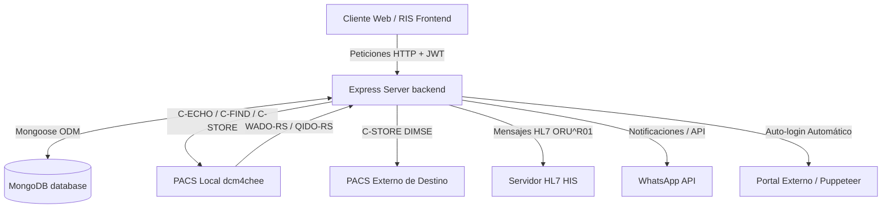

# 🏗️ Arquitectura y Flujo de Datos (Backend)

Este documento describe la arquitectura técnica del servidor backend de MedService, el cual sirve de soporte al visualizador DICOM y al Sistema de Información Radiológica (RIS).

---

## 📂 Patrón Arquitectónico y Estructura del Servidor

El backend de MedService está construido sobre **Node.js** utilizando el framework **Express**. Sigue un patrón modular de capas (MVC/Service Pattern) estructurado de la siguiente forma:

```text
server/
├── docs/                   # Documentación técnica del servidor
├── uploads/                # Directorio físico de archivos adjuntos (recibos, consentimientos)
├── documents/              # Directorio físico para PDFs e informes médicos generados
├── src/
│   ├── config/             # Configuración de base de datos MongoDB e inicializaciones (Seeders)
│   ├── controllers/        # Controladores que contienen la lógica de negocio de cada ruta
│   ├── middleware/         # Middlewares de Express (Autenticación JWT, control de roles)
│   ├── models/             # Esquemas de datos definidos con Mongoose (MongoDB)
│   ├── routes/             # Definición de rutas HTTP de Express y asociación con controladores
│   ├── services/           # Servicios integrados (WhatsApp, HL7, comunicación con PACS)
│   └── utils/              # Utilidades compartidas (Generación de tokens, Puppeteer Auto-Login)
└── server.js               # Punto de entrada de la aplicación (inicializa DB, Express y servicios)
```

---

## 🔄 Flujo de Datos e Integración de Sistemas

El backend de MedService actúa como un integrador crítico (Orquestador) entre el visualizador frontend, la base de datos documental, el sistema de mensajería, el servidor de mensajería HL7 (HIS) y el sistema de almacenamiento de imágenes PACS local y externo.



---

## 🛡️ Capa de Middleware y Seguridad (`src/middleware/auth.js`)

El acceso a las rutas sensibles del servidor está restringido mediante validación de JSON Web Tokens (JWT). El flujo de autenticación opera de la siguiente manera:

1.  **Extracción del Token:** El middleware recupera el token del encabezado de la petición: `Authorization: Bearer <TOKEN>`.
2.  **Verificación de Firma:** Se valida el token utilizando la clave secreta `JWT_SECRET`.
3.  **Inyección de Contexto:** Una vez validado, se adjuntan los datos decodificados del usuario (ID, rol, sucursal) a la petición (`req.user`), permitiendo que los controladores restrinjan el acceso o filtren los datos según la sede del operador.

---

## ⚙️ Servicios y Tareas en Segundo Plano

El servidor ejecuta múltiples hilos lógicos y rutinas automáticas programadas en segundo plano:

### 1. Robust DICOM Sync (`AUTO_ENVIO`)
Si la variable `AUTO_ENVIO=true` está habilitada en las variables de entorno, el backend arranca un ciclo periódico de sincronización automática gestionado por `setInterval`:
*   Realiza un comando `C-FIND` en el PACS local buscando estudios registrados en los últimos 3 días.
*   Compara el conteo de imágenes de forma remota contra el local mediante `C-FIND` iterativos.
*   Si detecta desajustes, descarga las instancias mediante WADO-RS/WADO-URI a la carpeta temporal `/src/temp` y las transmite al PACS externo mediante una petición de almacenamiento `C-STORE` (DIMSE nativo).

### 2. WhatsApp Notification Engine (`whatsapp.service.js`)
Servicio basado en `whatsapp-web.js` que se inicializa al arrancar el servidor. Crea una sesión y permite enviar notificaciones de estado de cita, links de descarga de estudios y alertas de caja a los pacientes y administradores de forma directa.

### 3. HL7 Message Dispatcher (`hl7.service.js`)
Procesa la interoperabilidad hospitalaria. Al firmarse digitalmente un informe médico en el RIS, el controlador invoca este servicio para ensamblar un mensaje HL7 tipo `ORU^R01` (Segmentos MSH, PID, OBR, OBX) y enviarlo vía sockets TCP al host del HIS configurado.

### 4. Puppeteer Portal Auto-login (`puppeteerLogin.js`)
Si la variable `AUTO_LOGIN=true` está activa, el servidor ejecuta una instancia de navegador headless mediante Puppeteer de manera programada para automatizar el inicio de sesión y la extracción de cookies/tokens en portales de salud de terceros.
